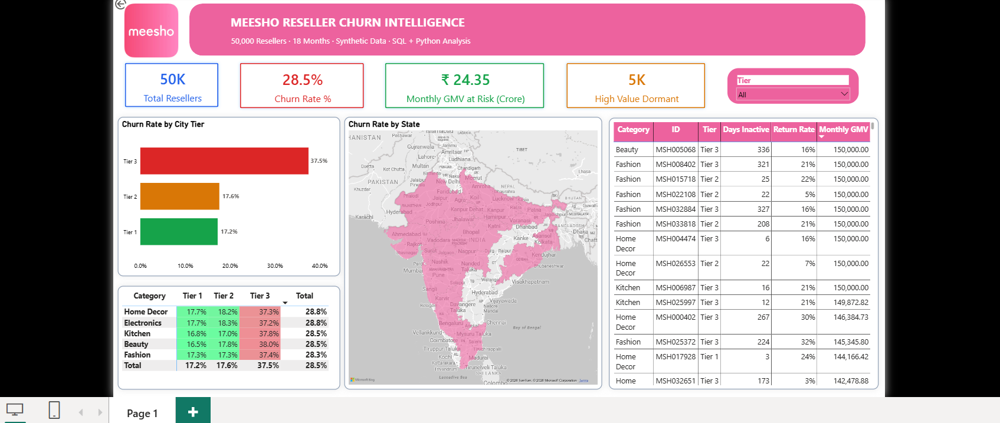
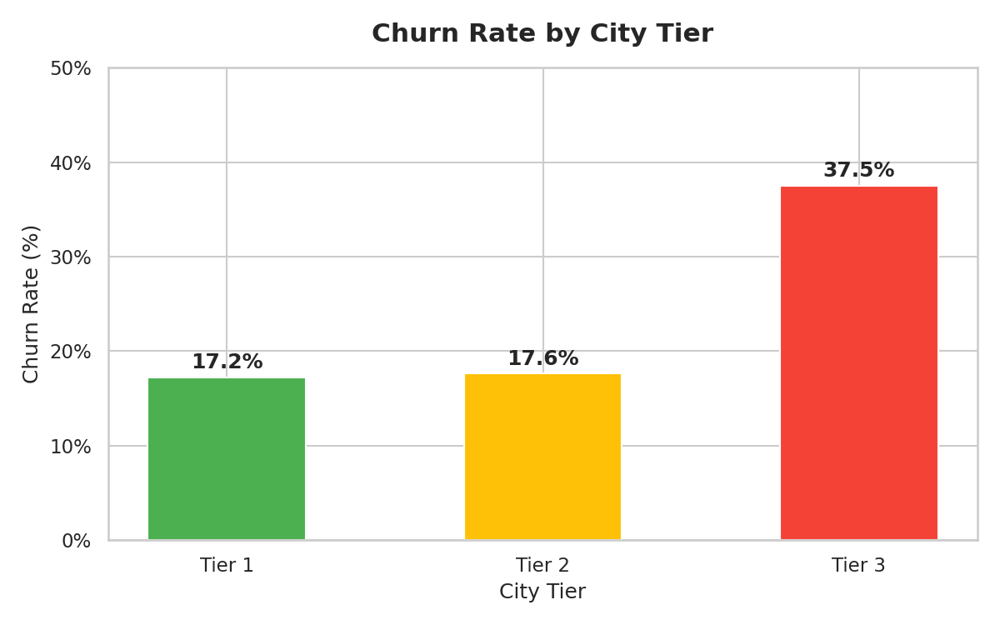
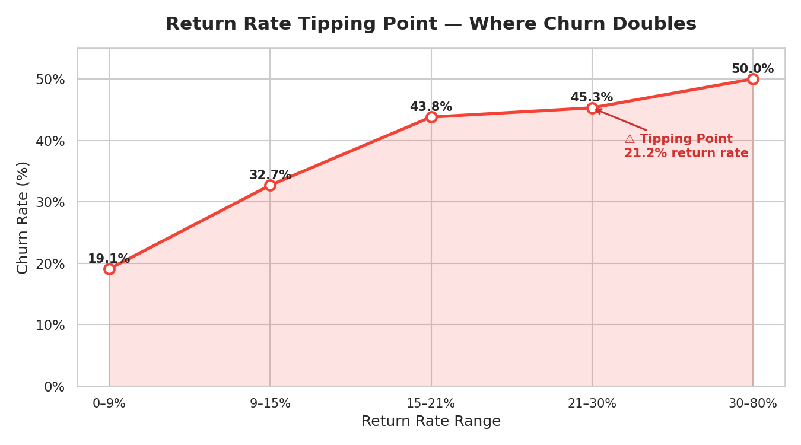
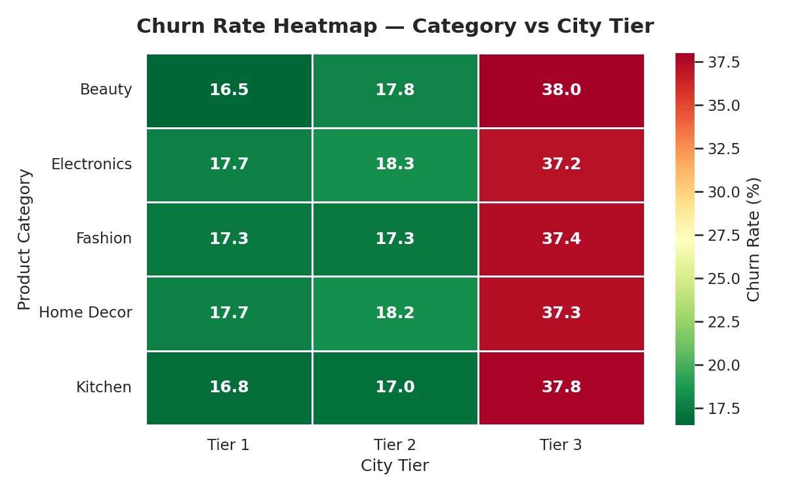
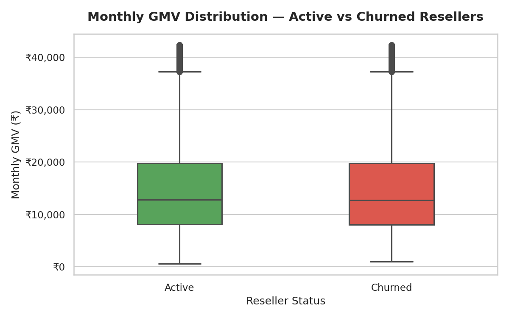
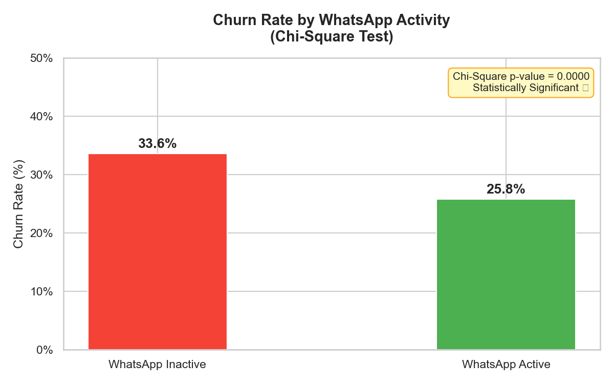
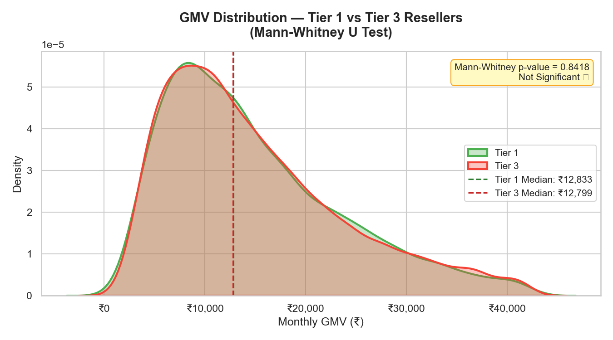

# Meesho Reseller Churn Intelligence



## Business Context

Meesho operates one of India's largest social commerce platforms with 13M+ resellers — predominantly homemakers and micro-entrepreneurs in Tier 2 and Tier 3 cities. Each reseller is a revenue engine. When they churn, Meesho loses not just their GMV but the entire network effect they bring.

This project simulates a real-world analytical problem: **identifying which resellers are at risk of churning, why they churn, and what the rupee impact is** — using SQL Server for analysis and Power BI for reporting.

> **Data note:** All 50,000 reseller records are synthetically generated using Python, anchored to publicly available Meesho business metrics (FY23 annual report, IAMAI social commerce reports). No real user data was used.

---

## Key Findings

| # | Finding | Number |
|---|---------|--------|
| 1 | Annual GMV at risk from churned resellers | **₹292 Crore** |
| 2 | Tier 3 churn rate vs Tier 1 | **37.5% vs 17.2% — 2.2x higher** |
| 3 | Churn tipping point — return rate threshold | **21.2%** |
| 4 | Churn rate in highest-risk segment (Tier 3 + High Returns) | **54%** |
| 5 | High-value dormant resellers — win-back opportunity | **5,149 resellers · ₹186 Cr/year** |
| 6 | WhatsApp inactive resellers churn more by | **7.8% (p < 0.0001)** |
| 7 | Tier 1 vs Tier 3 GMV difference | **Not significant (p = 0.84) — churn is experience-driven, not income-driven** |

---

## Tech Stack

| Tool | Purpose |
|------|---------|
| Python (Pandas, NumPy, Faker) | Synthetic data generation |
| Python (Matplotlib, Seaborn) | Exploratory data analysis & visualisation |
| Python (SciPy) | Hypothesis testing |
| SQL Server + SSMS | Data storage and analytical queries |
| Power BI (DAX) | Interactive dashboard |

---

## Project Structure

```
meesho-reseller-churn-analysis/
│
├── generate_data.py              # Synthetic data generation script
├── meesho_resellers.csv          # 50,000 reseller records
├── eda.py                        # Python EDA — 6 charts
├── hypothesis_testing.py         # Chi-square & Mann-Whitney tests
│
├── sql_queries/
│   ├── 01_churn_by_city_tier.sql         # Basic churn breakdown
│   ├── 02_churn_by_category.sql          # Category-level analysis
│   ├── 03_gmv_at_risk.sql                # GMV impact calculation
│   ├── 04_churn_segmentation_cte.sql     # Chained CTEs — risk profiling
│   ├── 05_return_rate_tipping_point.sql  # NTILE + RANK window functions
│   ├── 06_high_value_dormant.sql         # LAG + RANK — win-back targeting
│   └── 07_winback_opportunity.sql        # Total recovery opportunity
│
├── charts/
│   ├── 01_churn_by_tier.png
│   ├── 02_return_rate_tipping_point.png
│   ├── 03_churn_heatmap.png
│   ├── 04_gmv_distribution.png
│   ├── 05_whatsapp_churn_test.png
│   └── 06_tier_gmv_test.png
│
└── dashboard/
    ├── meesho_churn_dashboard.pbix
    └── dashboard_screenshot.png
```

---

## Methodology

### Data Generation
50,000 reseller records generated using Python with realistic distributions:
- **City tier split:** 55% Tier 3, 30% Tier 2, 15% Tier 1 — matching Meesho's stated geographic focus
- **GMV distribution:** Lognormal (right-skewed) — most resellers earn ₹5k–₹20k, few earn ₹80k+
- **Return rate:** Beta distribution — naturally bounded 0–1, peaks at 18–20%
- **Churn label:** Derived from a weighted formula of 6 behavioural signals — not randomly assigned

**Churn probability formula:**
```
churn_prob = 0.05
           + 0.25 × (return_rate > 22%)
           + 0.20 × (city_tier == 3)
           + 0.15 × (tenure_days < 90)
           + 0.10 × (monthly_orders < 3)
           + 0.08 × (whatsapp_active == 0)
           + 0.05 × (support_tickets > 3)
```

### SQL Analysis
Queries progress from basic aggregations to advanced window functions:
- **CTEs** for churn segmentation by return risk × city tier × category
- **NTILE(5)** to identify return rate tipping point
- **LAG() + RANK()** to surface high-value dormant resellers
- **CASE WHEN** for GMV-at-risk calculations

### Hypothesis Testing
Two statistical tests to validate findings beyond visual patterns:

**Test 1 — Chi-Square Test**
- H0: WhatsApp activity has no effect on churn
- Result: p-value = 0.000001 → **Rejected H0**
- WhatsApp inactive resellers churn 7.8% more — statistically proven

**Test 2 — Mann-Whitney U Test**
- H0: Tier 1 and Tier 3 resellers earn the same GMV
- Result: p-value = 0.84 → **Cannot reject H0**
- Insight: Churn is driven by experience (returns, support) — not income

---

## Charts

### Churn Rate by City Tier


### Return Rate Tipping Point


### Churn Heatmap — Category × City Tier


### GMV Distribution — Active vs Churned


### Hypothesis Test 1 — WhatsApp vs Churn


### Hypothesis Test 2 — Tier GMV Distribution


---

## Business Recommendations

1. **Trigger retention intervention at 21.2% return rate** — automated alert when a reseller crosses this threshold, before they churn
2. **Prioritise Tier 3 onboarding support** — new Tier 3 resellers churn 2x faster in months 1–3, suggesting an onboarding gap
3. **Launch WhatsApp re-engagement campaign** — inactive resellers churn 7.8% more; a targeted WhatsApp campaign could recover a meaningful share
4. **Win-back the 5,149 high-value dormant resellers** — they earned above-average GMV and represent ₹186 Cr annual recovery opportunity at 25% reactivation rate

---

## How to Run

**Generate data:**
```bash
pip install pandas numpy faker
python generate_data.py
```

**Run EDA:**
```bash
pip install matplotlib seaborn
python eda.py
```

**Run hypothesis tests:**
```bash
pip install scipy
python hypothesis_testing.py
```

**SQL queries:** Import `meesho_resellers.csv` into SQL Server using SSMS Import Flat File wizard, then run queries from `sql_queries/` folder in order.

**Dashboard:** Open `dashboard/meesho_churn_dashboard.pbix` in Power BI Desktop.

---

## Author

**Pratheebha Thiyagarajan**
B.Tech Information Technology — Sri Krishna College of Engineering and Technology

[LinkedIn](https://linkedin.com/in/your-profile) · [GitHub](https://github.com/Prathee11)
